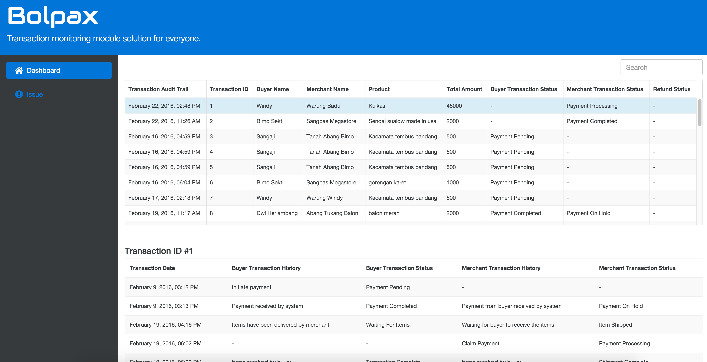

# bolpax-administrator

*This repo is now deprecated in favour of [the corresponding IMWIZZ repo](https://github.com/imwizz/bolpax-dashboard).*

---

Bolpax administrator frontend web UI for 
[Mandiri Hackathon](http://mandirihackathon.id) 2015-2016.



### Why?
In the spirit of giving a little help to my friend 
[Bayu](https://github.com/bayuanggoro), under the company name 
[IMWIZZ](http://imwizz.co.id), to build their hackathon product called **"Bolpax"**.

I also consider it as a divine opportunity to finally get my hands dirty on the 
React ecosystem.

As The Beatles said:
:notes:
> Oh, I get by with a little help from my friends

> Mm, gonna try with a little help from my friends

> Mm, I get high with a little help from my friends

> Yes I get by with a little help from my friends

> With a little help from my friends

:notes:

## What's on the Stack
* JavaScript ES6/7 (Babel)
* React
* Bootstrap 4
* lodash
* jQuery
* Webpack

## Installation

* Install [Node.js and npm](https://nodejs.org) [sic.]

* Checkout the repo, `cd` to project directory, and setup dependencies:
```bash
$ npm i rimraf updtr webpack webpack-dev-server -g
$ npm run install:clean
```

* For development, start Webpack development server with hot reloading capability:
```bash
$ npm run start
```
You'll find the app running on http://localhost:3000/.

* For production, build frontend static assets:
```bash
$ npm run build
```
Then, simply drop all files under `dist` directory to the production server.

## TODO
- [ ] Authentication flow
- [ ] Connect to backend

## Author
Glenn Dwiyatcita ([@dwiyatci](http://tiny.cc/dwiyatci))

## License
Apache License, Version 2.0.

See [LICENSE.txt](LICENSE.txt). 
